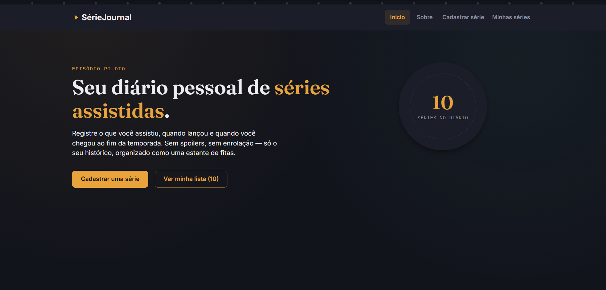
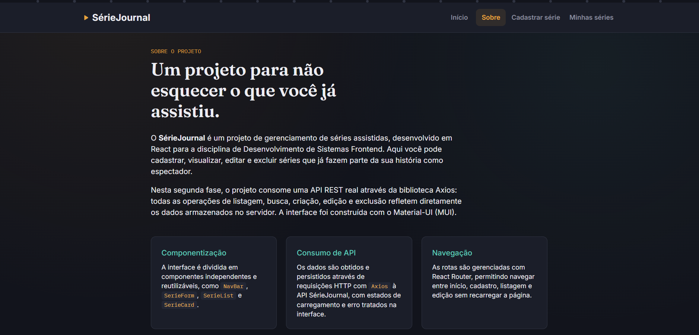
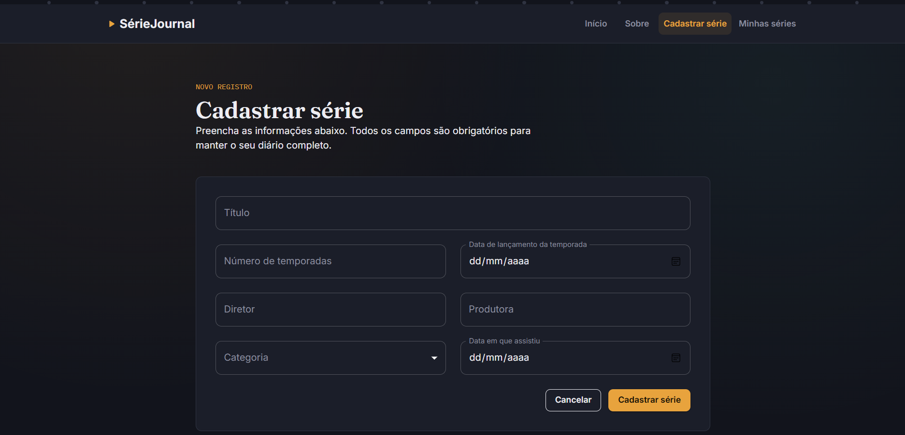
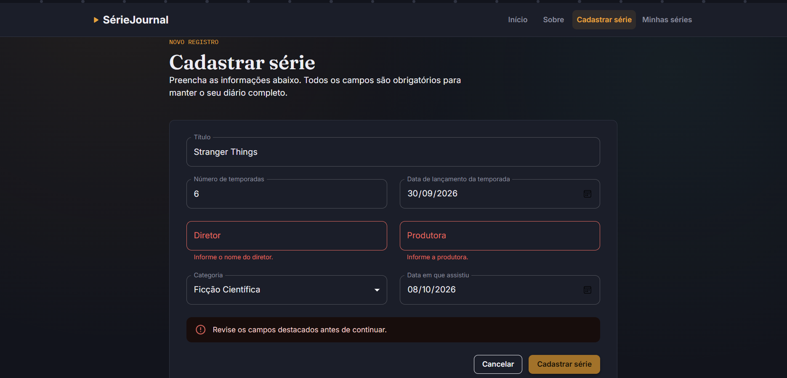
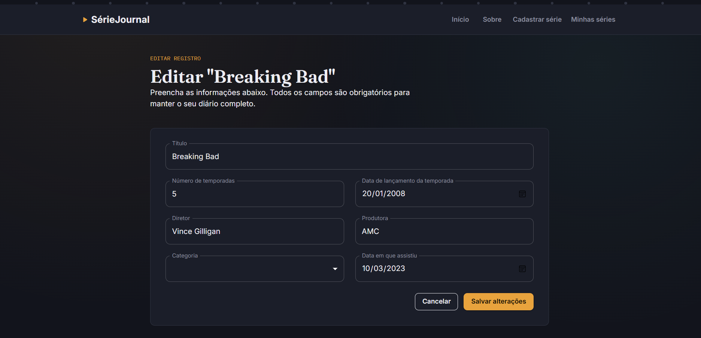
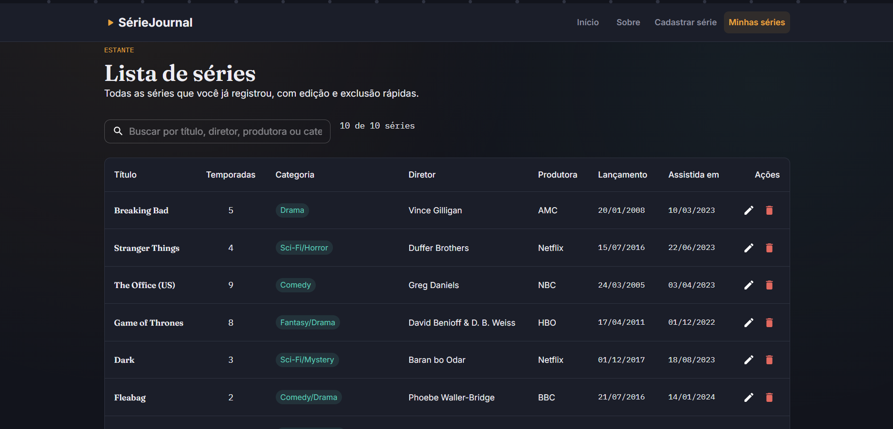

# SérieJournal — Fase 2

Projeto desenvolvido para a disciplina **Desenvolvimento de Sistemas Frontend**.

O SérieJournal é um diário pessoal de séries assistidas: permite cadastrar,
listar, buscar, editar e excluir séries. Nesta fase 2, a interface foi
reconstruída com **Material-UI (MUI)** e passou a consumir dados reais de uma
**API REST** (fornecida pela disciplina) através da biblioteca **Axios** — ou
seja, todas as operações refletem diretamente os dados armazenados no
servidor, não mais um estado estático em memória.

## Histórico do projeto

Este projeto foi desenvolvido em duas fases para a disciplina:

- **Fase 1**: interface estática em React (CSS puro), com dados fixos em
  memória e CRUD simulado localmente, sem persistência.
- **Fase 2** *(estado atual deste repositório)*: interface migrada para
  Material-UI, consumindo uma API REST real via Axios — CRUD completo
  persistido no servidor — e com testes automatizados (Vitest + React
  Testing Library).

O código da fase 1 pode ser consultado no histórico de commits do
repositório, anterior à migração para a fase 2.

## Pré-requisitos

- [Node.js](https://nodejs.org/) versão 18 ou superior instalado.
- Este projeto **depende da API `serieJournal-api`** para funcionar. Sem ela
  em execução, a aplicação carrega mas exibe uma mensagem de erro ao tentar
  listar/cadastrar séries.

## Como executar o projeto (passo a passo)

Você vai precisar de **dois terminais abertos ao mesmo tempo**: um para a API
e outro para o frontend (este projeto).

### 1. Suba a API

Em um terminal:

```bash
# Clone o repositório da API (se ainda não tiver)
git clone https://github.com/adsPucrsOnline/DesenvolvimentoFrontend.git

# Entre na pasta da API
cd DesenvolvimentoFrontend/serieJournal-api

# Instale as dependências
npm install

# Inicie a API
npm start
```

Se tudo der certo, a API ficará disponível em `http://localhost:5000`. Você
pode testar abrindo `http://localhost:5000/series` no navegador — deve
aparecer uma lista de séries em formato JSON.

**Deixe este terminal aberto e rodando** enquanto usa o frontend.

### 2. Rode o frontend (este projeto)

Em outro terminal, na pasta deste projeto (`serie-journal`):

```bash
# Instale as dependências
npm install

# Rode o projeto em modo de desenvolvimento
npm run dev
```

Abra o endereço exibido no terminal (geralmente `http://localhost:5173`).

> Por padrão, o frontend espera a API em `http://localhost:5000`. Caso
> precise apontar para outro endereço, edite o arquivo `.env` na raiz do
> projeto e altere o valor de `VITE_API_URL`.

### Se a API não estiver rodando

A tela de listagem exibirá uma mensagem de erro com um botão **"Tentar
novamente"**. Isso é esperado e faz parte do tratamento de erros da
aplicação — basta iniciar a API (passo 1) e clicar no botão.

### Outros comandos disponíveis

```bash
npm run build      # gera a versão de produção na pasta dist/
npm run preview    # serve a versão de produção localmente
npm run lint       # roda o oxlint para checar o código
npm run test       # roda a suíte de testes automatizados uma única vez
npm run test:watch # roda os testes em modo observador
```

## Como executar os testes

Este projeto usa **Vitest** e **React Testing Library** para testes
unitários dos componentes e do hook de integração com a API. Os testes
**não dependem da API estar rodando** — as chamadas HTTP são simuladas
(mockadas) em todos os testes.

```bash
npm run test
```

O projeto conta com 25 testes distribuídos em 6 arquivos, cobrindo:

- **`SerieForm.test.jsx`**: validação de campos obrigatórios, envio de dados
  corretos, tratamento de erro de rede e pré-preenchimento no modo edição.
- **`SerieList.test.jsx`**: estados de carregamento e erro, listagem e busca
  por título/diretor/produtora/categoria.
- **`SerieCard.test.jsx`**: renderização dos dados de uma série e o fluxo de
  confirmação antes da exclusão.
- **`NavBar.test.jsx`**: renderização dos links e destaque do link ativo.
- **`useSeries.test.js`**: busca inicial, tratamento de erro de conexão e
  atualização do estado local após criar, editar e remover uma série.
- **`seriesService.test.js`**: garante que cada função chama o endpoint HTTP
  correto (`GET`, `POST`, `PUT`, `DELETE`) com os parâmetros esperados.

## Tecnologias utilizadas

| Tecnologia | Função no projeto |
|---|---|
| [React 19](https://react.dev/) | Biblioteca principal para construção da interface |
| [Vite](https://vitejs.dev/) | Ferramenta de build e servidor de desenvolvimento |
| [React Router DOM v7](https://reactrouter.com/) | Gerenciamento de rotas entre páginas (SPA) |
| [Material-UI (MUI) v9](https://mui.com/) | Biblioteca de componentes de interface e sistema de temas |
| [Axios](https://axios-http.com/) | Cliente HTTP para consumir a API REST |
| [Vitest](https://vitest.dev/) + [React Testing Library](https://testing-library.com/react) | Testes unitários dos componentes e hooks |
| [oxlint](https://oxc.rs/docs/guide/usage/linter) | Linter usado para checar a qualidade do código |

## Estrutura do projeto

```
serie-journal/
├── docs/
│   └── screenshots/       -> imagens usadas neste README
├── public/                 -> arquivos estáticos servidos "como estão"
├── src/
│   ├── api/
│   │   ├── axiosInstance.js  -> instância do Axios configurada com a URL da API
│   │   └── seriesService.js  -> funções que encapsulam as chamadas HTTP (GET/POST/PUT/DELETE)
│   ├── hooks/
│   │   └── useSeries.js      -> hook customizado: estado, carregamento, erro e ações CRUD
│   ├── theme/
│   │   └── theme.js           -> tema customizado do Material-UI
│   ├── components/
│   │   ├── NavBar/            -> barra de navegação (MUI AppBar)
│   │   ├── SerieForm/         -> formulário de cadastro/edição
│   │   ├── SerieList/         -> tabela de séries com busca
│   │   └── SerieCard/         -> linha da tabela com ações de editar/excluir
│   ├── pages/
│   │   ├── Home/               -> página inicial ("/")
│   │   ├── About/               -> página "Sobre" ("/sobre")
│   │   ├── Register/            -> página de cadastro/edição ("/cadastrar" e "/editar/:id")
│   │   └── ListPage/            -> página de listagem ("/series")
│   ├── test/
│   │   └── setup.js             -> configuração global dos testes (jest-dom)
│   ├── App.jsx                  -> componente raiz: usa o hook useSeries e define as rotas
│   └── main.jsx                 -> ponto de entrada: tema, CssBaseline e roteador
├── .env                        -> variável VITE_API_URL (endereço da API)
├── index.html
├── package.json
└── README.md
```

## O que cada componente/módulo faz

- **`api/axiosInstance.js`**: cria uma instância do Axios com a URL base da
  API, lida a partir da variável de ambiente `VITE_API_URL`.

- **`api/seriesService.js`**: concentra as 5 chamadas HTTP usadas pelo
  projeto — buscar todas as séries, buscar por id, criar, atualizar e
  excluir — cada uma delas mapeada para a rota correspondente da API.

- **`hooks/useSeries.js`**: hook customizado que busca as séries ao montar,
  expõe os estados de `loading` e `error`, e oferece as funções `addSerie`,
  `editSerie` e `removeSerie`, que chamam a API e, em caso de sucesso,
  atualizam o estado local sem precisar refazer a busca completa.

- **`NavBar`**: barra de navegação fixa no topo (MUI `AppBar`), com links
  para todas as páginas e destaque visual do link correspondente à rota
  atual.

- **`SerieForm`**: formulário controlado (MUI `TextField`/`Select`) com os
  campos obrigatórios da série. Valida os campos ao perder o foco e ao
  enviar, exibe mensagens de erro específicas por campo e trata tanto erros
  de validação quanto falhas de comunicação com a API (com feedback visual
  via `Alert` e um estado de carregamento no botão de envio). É reutilizado
  tanto no cadastro quanto na edição.

- **`SerieList`**: recebe a lista de séries, o estado de carregamento e de
  erro via props. Implementa a busca em tempo real (por título, diretor,
  produtora ou categoria) e renderiza a tabela através do `SerieCard`,
  cobrindo os estados de carregando, erro de conexão, lista vazia e busca
  sem resultados.

- **`SerieCard`**: renderiza uma linha da tabela com os dados de uma série e
  os botões de **editar** (navega para a tela de edição) e **excluir** (abre
  um diálogo de confirmação do MUI antes de chamar a API).

## Páginas

- **Início (`/`)**: página de boas-vindas, com contagem de séries obtida da API.
- **Sobre (`/sobre`)**: explica o propósito e as tecnologias do projeto.
- **Cadastrar série (`/cadastrar`)**: formulário de inclusão de novas séries via `POST`.
- **Minhas séries (`/series`)**: listagem, busca, edição e exclusão de séries via `GET`/`PUT`/`DELETE`.
- **Editar série (`/editar/:id`)**: reaproveita a tela de cadastro, pré-preenchida com os dados da série.

## Rotas da API consumidas

| Método | Rota | Uso no projeto |
|---|---|---|
| `GET` | `/series` | Listagem de todas as séries |
| `GET` | `/series/:id` | (disponível, não utilizada diretamente — a edição reaproveita os dados já carregados na listagem) |
| `POST` | `/series` | Cadastro de uma nova série |
| `PUT` | `/series` | Atualização de uma série existente (o `id` vai no corpo da requisição) |
| `DELETE` | `/series/:id` | Exclusão de uma série |

## Capturas de tela

> As imagens abaixo foram capturadas com a API em execução, exibindo dados reais retornados pelo servidor.

### Página inicial


### Página Sobre


### Cadastro de séries


### Validação do formulário


### Edição de série


### Lista de séries


## Decisões de desenvolvimento

- **Nomenclatura dos campos**: os campos do formulário e da listagem
  (`title`, `seasons`, `releaseDate`, `director`, `production`, `category`,
  `watchedAt`) foram definidos em inglês para corresponder exatamente aos
  dados de exemplo já presentes na API (`data/series-exemplo.json`),
  garantindo que os registros pré-existentes sejam exibidos corretamente.
- **Material-UI com tema customizado**: em vez de usar o tema padrão do MUI,
  foi criado um tema próprio (`src/theme/theme.js`) mantendo a identidade
  visual do projeto (paleta escura com dourado e teal, tipografia serifada
  para títulos), demonstrando o uso do sistema de temas da biblioteca além
  dos componentes prontos.
- **Hook customizado (`useSeries`)**: centraliza toda a lógica de estado e
  comunicação com a API em um único lugar, evitando duplicação entre as
  páginas de listagem e cadastro/edição, e mantendo os componentes de UI
  focados apenas em apresentação.
- **Atualização otimista do estado local**: após criar, editar ou excluir
  uma série com sucesso, o estado local é atualizado diretamente com a
  resposta da API, sem a necessidade de uma nova requisição de listagem
  completa.
- **Testes com mocks**: os testes automatizados simulam as respostas da API
  (via `vi.mock`), permitindo validar o comportamento dos componentes e do
  hook de forma isolada e rápida, sem exigir que a API esteja em execução.
